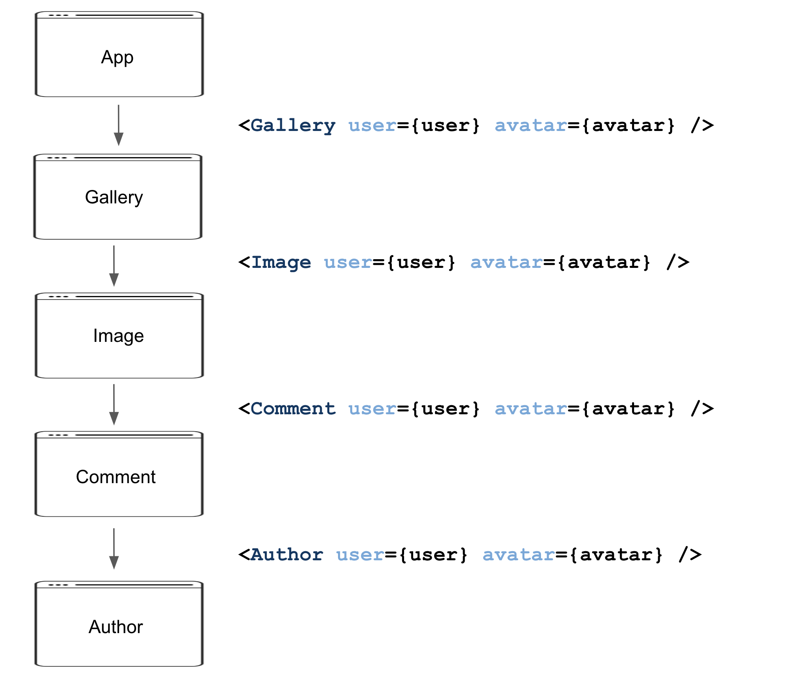

# React Code Smells

## Table of Contents

* __[Introduction](#introduction)__
* __[Novel Smells](#novel-smells)__
  * [Force Update](#force-update)
  * [Direct DOM Manipulation](#direct-dom-manipulation)
  * [Props in Initial State](#props-in-initial-state)
  * [Uncontrolled Components](#uncontrolled-components)
  * [JSX outside the render method](#jsx-outside-the-render-method)
* __[Partially Novel Smells](__partially-smells)__
  * [Prop Drilling](#prop-drilling)
  * [Too Many Props](#too-many-props)
* __[Traditional Smells](traditional-smells)__
  * [Inheritance instead of Composition](#inheritance-instead-of-composition)
  * [Duplicated Component](#duplicated-component)
  * [Large Component](#large-component)
  * [Large Files](#large-files)
  * [Low Cohesion](#low-cohesion)


## Introduction 

Released by [*Facebook*][Facebook] in 2013, [*React*][React] is a widely popular JavaScript library for building user interfaces. Due to the complexity of modern Web UIs, React applications can have hundreds of components, lines of code, and files. As a result, it is natural to expect maintainability problems in React-based UIs due to wrong or suboptimal design decisions. In this context, identifying design problems when using this library is important. For example, front-end developers can use this information for refactoring and better understanding and evolving their systems. However, few works in the scientific literature focused on studying maintainability problems in React-based UIs.

Therefore, to fill this gap, we propose an initial list of code smells common in *React* applications. These smells were identified by looking for specific *React* code smells in websites, blogs, and forums (grey literature review) and interviewing six professional software developers. 

We did not include in our catalog smells describing low-level concerns that can be detected by linter tools[^1] (e.g., ``modify state directly``, ``array index as key``, ``no access state in setState``, ``props spreading``, etc.). Since code smells are a widely studied concept, not only in object-oriented designs but also in particular domains, we classified these smells into three major categories: [Novel Smells](#novel-smells), [Partially Novel Smells](__partially-smells), and [Traditional Smells](traditional-smells). Below, we present our catalog of smells. For each smell, we provide its definition and an illustrative example.

The objective of this catalog is to help improve the quality of web applications developed using React. For this reason, we are interested in knowing React's community opinion about these code smells: *Do you agree that these code smells can be harmful? Have you seen any of them in production code? Do you have any suggestions about some React-specific code smell not cataloged by us?...*

Please feel free to make pull requests and suggestions ([Issues][Issues] tab). We want to hear from you!

[^1]: [React specific linting rules for ESLint][eslint-plugin-react]

## Novel Smells

We claim our list includes five smells that have not been studied in the scientific literature: Force Update, Direct DOM Manipulation, Props in Initial State, Uncontrolled Components, and JSX Outside the Render Method. They refer to features very specific to React, including View updates, Components that manipulate DOM directly, Components that refer to HTML elements, Components' state, and render methods. 

### Force Update
JavaScript frameworks rely on a data binding mechanism to keep the View layer updated with data automatically. Particularly, React supports one-way data binding, which automatically reflects model changes in the view. For this reason, it is considered a bad practice to force the update of components or even reload the entire page to update some content, as recommended in React documentation: 

> Normally, you should try to avoid all uses of ``forceUpdate()`` and only read from ``this.props`` and ``this.state`` in ``render()``.

For example, the following code realod the entire page to update the contents submitted through a form.

```jsx
onSubmitForm = async () => {
    const { homeDashboardId, theme, timezone, weekStart } = this.state;
    await this.service.update({ homeDashboardId, theme, timezone, weekStart });
    window.location.reload();
 };
```

### Direct DOM Manipulation
React uses its own representation of the DOM, called virtual DOM, to denote what to render. When props and state change, React updates the virtual DOM and send the changes to the real DOM. For this reason, manipulating DOM using vanilla JavaScript can cause inconsistencies between React’s virtual DOM and the real DOM. In the following code, the component ``Portal`` creates and manipulates DOM elements through methods such as ``document.createElement('div')``, ``document.body.appendChild(this.node)`` and ``this.node.setAttribute``.

```jsx
class Portal extends React.PureComponent<PortalProps, {}> {
  node: HTMLElement;

  constructor(props: PortalProps) {
    super(props);
    const { index = 0, origin = 'query', style } = props;
    this.node = document.createElement('div');
    this.node.setAttribute('style', style);
    this.node.classList.add(`slate-typeahead`, `slate-typeahead-${origin}-${index}`);
    document.body.appendChild(this.node);
  }

  componentWillUnmount() {
    document.body.removeChild(this.node);
  }

  render() {
    if (this.props.isOpen) {
      this.node.setAttribute('style', this.props.style);
      this.node.classList.add(`slate-typeahead--open`);
      return ReactDOM.createPortal(this.props.children, this.node);
    } else {
      this.node.classList.remove(`slate-typeahead--open`);
    }

    return null;
  }
}
```

### Props in Initial State
Initializing state with props makes the component to ignore props updates. If the props values change, the component will render its first values. React documentation also states about this smell:

> Using props to generate state in the constructor (or \texttt{getInitialState}) often leads to duplication of "source of truth", for example where the real data is. This is because the constructor (or \texttt{getInitialState}) is only invoked when the component is first created.

For example, the component ``ListNames`` initializes the state of names and ages with props.

```jsx
class ListNames extends Component {
  constructor(props){
    super(props);
    this.state = {
      names: props.names,
      ages: props.ages,
    };
  }
}
```

### Uncontrolled Components
Forms are key elements in Web UIs. The official React documentation recommends using controlled components to implement forms. In such components, React fully handles the form’s data. On the other hand, developers can implement forms using vanilla HTML, where the form data is handled by the DOM itself, leading to so-called Uncontrolled Components. For example, the following ``AddComment`` component is considered Uncontrolled, since it uses a ``ref`` to get the comment value.

```jsx
class AddComment extends React.Component {
  // ...
  render() {
    return (
      <form onSubmit={this.handleSubmit}>
        <label>Comment:</label>
        <input type="text" ref={this.input} />
        <input type="submit" value="Submit" />
      </form>
    );
  }
}
```
On the other hand, when developers use controlled components, all data is stored in the component’s state, making it easy to validate fields instantly or render them conditionally.

### JSX outside the render method

The ``render`` method is the only method that is mandatory in a class component. It provides the JSX template for all UI elements. Normally, we assume that all JSX code is confined in the ``render`` method. The existence of JSX code in other methods indicates that the component is assuming too many responsibilities and providing a complex UI element. As a result, it is more difficult to reuse the component in other pages or apps. For example, in the following ``Gallery`` component, we have three ``render`` methods: one to render an ``Image`` (that calls ``renderComment()``), the method that only renders ``Comments``, and the main ``render`` method (that calls ``renderImage()``). However, suppose we want to handle just a ``Comment``. In this case, it is impossible to rely on ``Gallery`` since this component also provides other visual elements, such as the ones needed to represent an ``Image``.

```jsx
class Gallery extends React.Component {
   renderComment() {
      return (<div> ... </div>)
   }

   renderImage() {
      return (
        <div> 
            ...
            {this.renderComment()}
        </div>)
   }

   render() {
      return (
         <div>
            {this.renderIamge()}
            {this.renderComment()}
            ...
         </div>
      );
   }
}
```

In summary, the presence of JSX code in multiple methods indicates a complex UI element, which might be decomposed into smaller and reusable ones.

## Partially Novel Smells

We classified a single smell in our catalog as partially novel: Prop Drilling. For example, Ousterhout et. al. mention a design red flag called Pass-Through Methods, i.e., a method that does nothing but pass its arguments to another method with a similar signature. However, in our case, Prop Drilling does not relate to methods but components. As a second observation, Prop Drilling resembles to some degree a Middle Man class, i.e., a class that delegates most of its work to other classes. However, Middle Man classes by definition are anemic in the terms of behavior and data, which is not the case of Prop Drilling. In other words, a complex component can also be used to pass through properties to its child components. 

### Prop Drilling

Props drilling refers to the practice of passing props through multiple components in order to reach a particular component that needs the property. Therefore, the intermediate components act only as a bridge to deliver the data to the target component. For example, consider an App to create a ``Gallery`` that renders images and allows comments in each one (see Figure bellow). First, the App renders ``Gallery`` passing the user and avatar props. Then, the ``Image`` renders the ``Comment`` components, also passing the ``user`` and ``avatar`` props. Finally, ``Comment`` renders ``Author``, passing again the ``user`` and ``avatar`` props. In other words, ``Author`` is the only component that really needs to use these props. 



<!-- "){:height="50%" width="50%"} -->

As the codebase increases, Prop Drilling makes it challenging to figure out where the data is initialized, updated, or used. Furthermore, it results in tightly coupled components. On the other hand, there are alternatives to avoid prop drillings, such as component composition and Context API. Since each component is usually in a separate file, in our ``Gallery`` example (see Figure), there are five different files to check for property updates, including, Author.jsx, Comment.jsx, Image.jsx, Gallery.jsx, and the file that calls the ``Gallery`` component, App.jsx. Moreover, Prop Drilling results in tightly coupled components. For example, whenever the Author component needs more props from the top, all the intermediate levels must be updated. Finally, it is worth mentioning that React documentation recommends using component composition:

> _If you only want to avoid passing some props through many levels, component composition is often a simpler solution than context._


## Traditional Smells

In the grey literature and the interviews with developers, we identified six smells that are similar to traditional smells: Inheritance instead of Composition (since the inverse relation is considered a good object-oriented principle), Duplicated Component (which is a particular case of Duplicated Code), Large File, Large Component (which can be considered a particular case of the traditional Large Class), and Low Cohesion. We also consider that Too Many Props is similar to Data Class and Large Class proposed by Martin Fowler. A Data Class has mostly data and only setter and getter methods. A Large Class is a class with several responsibilities. On the other hand, Too Many Props designates a component with a large number of props. Essentially, this smell is very similar to the well-kwon Long Parameter List smell, proposed by Fowler. Just to clarify, in React, properties designates the parameters passed into components.

### Inheritance instead of Composition

In React, developers tend to use inheritance to tackle two problems: (1) to express containment relations, particularly when a component does not know their possible children; (2) to express specialization relations, when components are ''special cases'' of other components. However, as usual in object-oriented design, React developers recommend using composition over inheritance whenever possible. 

For example, consider a page that handles ``Employee`` and a special case called ``Developer``, which has a ``level`` and receives a ``bonus``. A possible design consists of creating a generic form to receive data common to all employees and reuse it in the form that handles ``Developer`` data, as in the following code: 

```jsx
class Employee extends React.Component {
   render() {
      return (<div> Name: {this.props.name} </div>);
   }
}
```

```jsx
class Developer extends Employee {
   render() {
      return (
         <div>
            |\colorbox{yellow}{\{super.render()\}}| 
            Level: <input type="text" />
            Bonus: <input type="number" />
         </div>
      )
   }
}
```

However, inheritance results in a tight coupling between components. For example, changes in the base component can affect all child components in unpredictable ways. On the other hand, by using composition instead of inheritance, we can reuse only the UI behavior, as in the following example:

```jsx
class Developer extends React.Component {
   render() {
      return (
         <div>
            <Employee name="Bob"/>
            Level: <input type="text" />
            Bonus: <input type="number" />
         </div>
      )
   }
}
```

### Duplicated Component
This smell refers to almost identical components. For example, the problem usually occurs when multiple developers extract the same UI code to different components are unaware of an existing component and reimplement it. In the following example, {\tt Comment} and {\tt Opinion} have the same code.

```jsx
function Comment(props) {
  return (
    <div>
      <User user={props.user} />
      <div>{props.text} </div>
      <div>{props.date}</div>
    </div>
  );
}
```

```jsx
function Opinion(props) {
  return (
    <div>
      <User user={props.user} />
      <div>{props.text} </div>
      <div>{props.date}</div>
    </div>
  );
}
```

### Too Many Props

Props (React stands for properties) are arguments passed to components via HTML attributes. However, it is hard to understand components with a long list of props. For example, consider the ``Comment`` component used as an example in React’s documentation. This component has many properties, including the four properties presented in the following code:

```jsx
function Comment(props) {
  return (
    <div>
      <div>{props.name}</div>
      
      <div>{props.text} </div>
      <div>{props.date}</div>
      // other props
    </div>
  );
}
```

To reduce the number of props handled by ``Comment``, we can extract the props related to avatars (i.e., ``name`` and ``avatarUrl``) to a new component, called ``Avatar``. Then, ``Comment`` just references this new component, as in the following code:

```jsx
function Comment(props) {
  return (
    <div>
      <Avatar avatar={props.avatar} />
      <div>{props.text} </div>
      <div>{props.date}</div>
    </div>
  );
}
```

### Large Component
Clean and small components improve  readability and maintainability. For example,  \textsc{React} documentation provides this recommendation for refactoring large components

> If a part of your UI is used several times, or is complex enough on its own, it is a good candidate to be extracted to a separate component.


### Large Files

A large file is one with several components whose implementation requires several lines of code. Indeed, some developers advocate that we should have exactly one component per file. See for example the following comment from one the interviewed developers:

> I got tired of trying to fix a bug on a component co-located with other six components in a file with thousands of lines.

### Low Cohesion

As usual in software design, the implementation of components must be cohesive and follow the Single Responsibility Principle. In other words, each component's data and behavior must be related to make the component reusable and easy to understand. 

## About

This catalog was proposed by Fabio Ferreira and Marco Tulio Valente, from [ASERG/DCC/UFMG][ASERG].

Please feel free to make pull requests and suggestions ([Issues][Issues] tab).

<!-- Links -->
[React]: https://reactjs.org
[Facebook]: https://github.com/facebook
[ASERG]: http://aserg.labsoft.dcc.ufmg.br/
[Issues]: https://github.com/fabiosferreira/React-Code-Smells/issues
[eslint-plugin-react]: https://github.com/yannickcr/eslint-plugin-react
